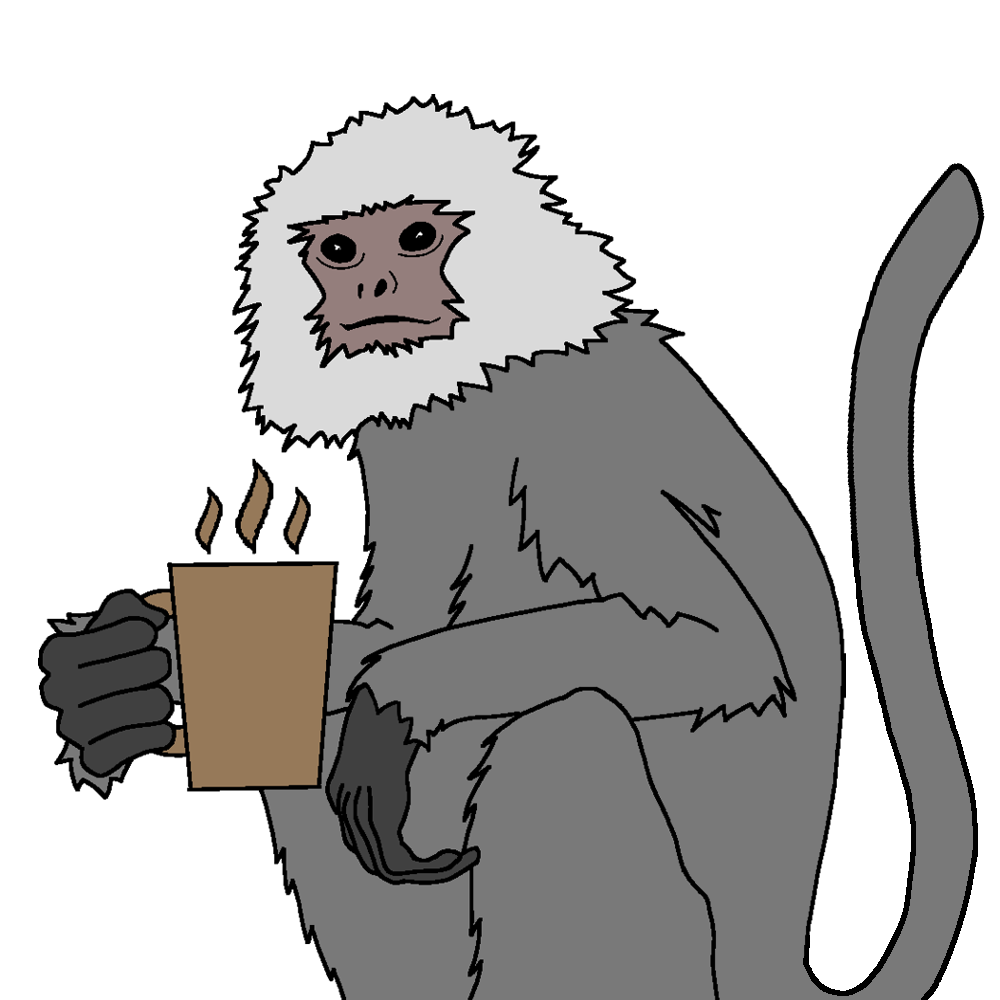

<h1 align="center" style="font-size:200px; font-famili:Raleway">entel - Share Your Needs</h1>

  
  
  

 

## Proposed changes

Please describe your changes here to communicate to the maintainers why we should accept this pull request. If it fixes a bug or resolves a feature request, be sure to link to that issue.
If your feature changes curretn behavior, please argue why your solution is better or start a discussion. 

## Types of changes

What types of changes does your code introduce to Appium?
_Put an `x` in the boxes that apply_

- [ ] Bugfix (non-breaking change which fixes an issue)
- [ ] New feature (non-breaking change which adds functionality)
- [ ] Breaking change (fix or feature that would cause existing functionality to not work as expected)
- [ ] Documentation Update (if none of the other choices apply)

## Checklist

_Put an `x` in the boxes that apply. You can also fill these out after creating the PR. If you're unsure about any of them, don't hesitate to ask. We're here to help! This is simply a reminder of what we are going to look for before merging your code._

- [ ] Please make sure all test have passed and you have not introduced new compiler warnings
- [ ] Have you added necessary documentation (README, documentation etc.) (if appropriate)
- [ ] Keep pull requests small so they can be easily reviewed
- [ ] Please avoid making changes to the overall architecture (unless discussed before)

Thank you for your contribution! We appreciate your help!
